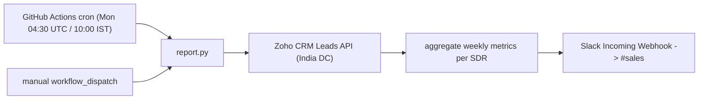

# Weekly SDR Report (Zoho CRM to Slack)

Automatically posts a weekly summary of the SDR team's activity from Zoho CRM to a
Slack channel (`#sales`) every Monday at 10:00 AM IST. Runs for free on GitHub
Actions, no server required.

## What it reports

For the **previous work week (Monday to Friday, weekends excluded)**, per SDR:

- **Leads Created** — leads whose `Created_Time` falls in the window.
- **Leads Modified** — leads edited in the window, excluding those created in the
  same window (so it reflects work on pre-existing leads).
- **Calls** — every modified lead that carries a `Remarks` entry counts as a logged
  call. A call is **connected** unless the remark contains "DNP" (Did Not Pick);
  remarks mentioning DNP are counted as **not connected**.
- **Meetings Set** — leads whose `Lead_Status` is `Meeting Set`.
- A **day-wise breakdown** per SDR for calls and meetings.

Data comes from the Zoho CRM **Leads** module only.

## Partner Report

A second, independent report posts **partner** deal stats from the Zoho CRM **Deals**
module to the same `#sales` channel every **Thursday at 12:00 PM IST**. It covers
**Rubix** and **InCorp** as separate subsections in a single message (add more partners
via the `PARTNERS` list in `report.py`). Run it locally with `python report.py --partners`.

Per partner (filtered by `Partner`), for the **trailing 7 days** (`now - 7d` to `now`):

- **Meetings** — deals in a "Meeting Done" stage (`Meeting Done - SQL` or
  `Meeting Done - Not SQL Yet`) modified in the window; shows summed `Amount` and count.
- **SQL Movement** — deals with `SQL == "Yes"` modified in the window; shows summed
  `Amount` and count.

Plus two point-in-time snapshots (summing `Amount` of open deals by `Closing_Date`):

- **Pipeline ≤30 days** — open deals closing within the next 30 days.
- **Pipeline ≤90 days** — open deals closing within the next 90 days.

Meetings and SQL Movement use `Modified_Time` as a proxy for "movement" because Zoho
stores no stage-change or SQL-change timestamp (`Stage_Modified_Time` is null on these
deals). It reuses the same `SLACK_WEBHOOK` secret as the SDR report.

### Sample Partner Slack message

```
🤝 Partner Report
02 Jul – 09 Jul 2026

Rubix
• Meetings (last 7 days): ₹35.00L  (3 deals)
• SQL Movement (last 7 days): ₹28.50L  (2 deals)
• Pipeline ≤30 days: ₹76.75L  (8 deals)
• Pipeline ≤90 days: ₹2.13Cr  (24 deals)

InCorp
• Meetings (last 7 days): ₹0  (0 deals)
• SQL Movement (last 7 days): ₹0  (0 deals)
• Pipeline ≤30 days: ₹12.50L  (1 deal)
• Pipeline ≤90 days: ₹27.25L  (2 deals)
```

### Sample Slack message

```
📊 Weekly SDR Report
29 Jun – 03 Jul 2026

Team Summary
• Leads Created: 7
• Leads Modified: 17
• Calls Done: 14  (Connected: 13, DNP: 1)
• Meetings Set: 3

Pranathi
• Leads: 4 created, 12 modified
• Calls: 10 done, 10 connected, 0 DNP
• Meetings Set: 2
      Mon 29 Jun: Calls 3/3 conn, Meetings 1
      Wed 01 Jul: Calls 0/0 conn, Meetings 1
      Thu 02 Jul: Calls 3/3 conn
      Fri 03 Jul: Calls 4/4 conn

Indrani
• Leads: 3 created, 5 modified
• Calls: 4 done, 3 connected, 1 DNP
• Meetings Set: 1
      Tue 30 Jun: Calls 1/1 conn
      Thu 02 Jul: Calls 3/2 conn, Meetings 1
```

## How it works



On each run, `report.py`:

1. Exchanges the Zoho **refresh token** for a fresh 1-hour access token.
2. Fetches all Leads (with `page_token` pagination for >2000 records).
3. Aggregates the metrics above for the previous Mon–Fri window (IST).
4. Formats a Slack `mrkdwn` message and POSTs it to the Incoming Webhook.

## Project structure

```
.github/workflows/weekly-report.yml   Scheduled + manual SDR workflow (Mon 10:00 IST)
.github/workflows/partner-report.yml  Scheduled + manual partner workflow (Thu 12:00 IST)
report.py                             Main script (Lead, Deal, ZohoClient, WeeklyReport, PartnerReport, SlackNotifier)
requirements.txt                      Python dependencies (requests, python-dotenv)
.gitignore                            Keeps .env and caches out of git
```

Code overview (`report.py`):

- `Lead` — wraps a CRM lead record with typed properties (`created_at`, `modified_by`,
  `remarks`, `is_connected`, `is_meeting_set`, ...).
- `Deal` — wraps a CRM deal record (`partner`, `stage`, `sql`, `amount`, `closing_date`,
  `is_open`, `is_meeting_done`, `is_sql`, ...).
- `ZohoClient` — auth + paginated `fetch_leads()` / `fetch_deals()`.
- `WeeklyReport` — computes the work-week window and builds the SDR Slack message.
- `PartnerReport` — per-partner trailing-7-day metrics and pipeline snapshots;
  `build_partner_message()` combines all partners in `PARTNERS` into one message.
- `SlackNotifier` — posts to the webhook.

## Local setup

```bash
python3 -m venv .venv && source .venv/bin/activate
pip install -r requirements.txt
```

Create a `.env` file in the project root:

```
ZOHO_CLIENT_ID=...
ZOHO_CLIENT_SECRET=...
ZOHO_REFRESH_TOKEN=...
SLACK_WEBHOOK=https://hooks.slack.com/services/XXX/YYY/ZZZ
```

Preview the message without posting:

```bash
python report.py --dry-run
```

Run for real (posts to Slack):

```bash
python report.py
```

## Zoho authentication

The account is on the **India** data center (`accounts.zoho.in` / `www.zohoapis.in`).

1. Go to `https://api-console.zoho.in/` and create a **Self Client** (or reuse one).
2. Generate a **grant token** with scope `ZohoCRM.modules.ALL` (or at least
   `ZohoCRM.modules.leads.READ`), with a short validity.
3. Exchange the grant token for a **refresh token** (do this within minutes — grant
   tokens expire fast):

```bash
curl -X POST "https://accounts.zoho.in/oauth/v2/token" \
  -d "grant_type=authorization_code" \
  -d "client_id=YOUR_CLIENT_ID" \
  -d "client_secret=YOUR_CLIENT_SECRET" \
  -d "code=YOUR_GRANT_TOKEN"
```

4. Store the returned `refresh_token` as `ZOHO_REFRESH_TOKEN`. The script converts it
   to an access token automatically on every run.

## Slack setup

1. `https://api.slack.com/apps` → **Create New App** → **From scratch** → select your
   workspace.
2. **Incoming Webhooks** → toggle on → **Add New Webhook to Workspace** → choose
   `#sales` → **Allow**.
3. Copy the webhook URL into `SLACK_WEBHOOK`.

## Deploy (GitHub Actions)

1. Push the repo to GitHub.
2. **Settings → Secrets and variables → Actions** → add four repository secrets:
   `ZOHO_CLIENT_ID`, `ZOHO_CLIENT_SECRET`, `ZOHO_REFRESH_TOKEN`, `SLACK_WEBHOOK`.
3. The workflow ([.github/workflows/weekly-report.yml](.github/workflows/weekly-report.yml))
   runs every Monday at 04:30 UTC (10:00 AM IST). Use the **Actions** tab →
   **Weekly SDR Report** → **Run workflow** to trigger a run on demand.

## Configuration notes

- **SDR name mapping** — CRM accounts belong to AEs but are operated by SDRs, so names
  are remapped for display via `SDR_NAME_MAP` in `report.py`
  (`Jai Rathi → Pranathi`, `Eshan Aggarwal → Indrani`). Add entries here as needed.
- **Work-week window** — `WeeklyReport.previous_work_week()` covers the previous
  Monday 00:00 to Friday 23:59:59 IST.
- **Connected vs. not connected** — controlled by the `DNP_RE` regex (matches "DNP",
  case-insensitive).
- **Meetings Set** — controlled by `MEETING_SET_STATUS` (`"Meeting Set"`).

## Maintenance and caveats

- **Access tokens** refresh automatically each run — nothing to manage.
- **Refresh token** is long-lived and does not expire on a timer. You only need to
  regenerate it (and update the GitHub secret) if it is revoked, e.g. the client secret
  is rotated or tokens are revoked in the Zoho API console.
- **GitHub disables scheduled workflows after 60 days of repository inactivity.** If the
  repo sees no commits for that long, the cron is paused and you re-enable it from the
  Actions tab (or push any commit).
- **Cron timing is best-effort** — GitHub may delay scheduled runs by several minutes
  during peak load.

## Cost

Free: GitHub Actions scheduled jobs, Zoho CRM API (within your edition limits), and
Slack Incoming Webhooks.
