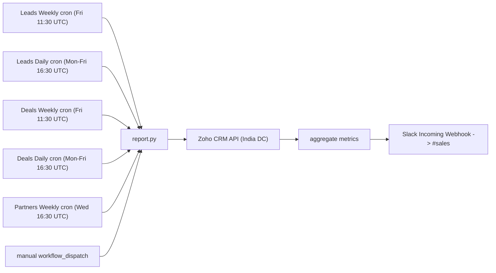

# Zoho CRM Reports to Slack

Automatically posts SDR lead activity, partner deal stats, and AE/AD deal movement from
Zoho CRM to a Slack channel (`#sales`). Five scheduled reports run for free on GitHub
Actions — no server required:

| Report | Schedule | Workflow |
|--------|----------|----------|
| **Leads Weekly Report** | Friday 5:00 PM IST | `leads-weekly-report.yml` |
| **Leads Daily Report** | Weekdays 10:00 PM IST | `leads-daily-report.yml` |
| **Weekly Deal Report** | Friday 5:00 PM IST | `deals-weekly-report.yml` |
| **Daily Deal Report** | Weekdays 10:00 PM IST | `deals-daily-report.yml` |
| **Partners Weekly Report** | Wednesday 10:00 PM IST | `partners-weekly-report.yml` |

## Leads Weekly Report

Posts a summary of the SDR team's activity from the Zoho CRM **Leads** module every
**Friday at 5:00 PM IST**.

For the **current work week (Monday to Friday, weekends excluded)**, per SDR:

- **Leads Created** — leads whose `Created_Time` falls in the window.
- **Leads Modified** — leads edited in the window, excluding those created in the
  same window (so it reflects work on pre-existing leads).
- **Calls** — every modified lead that carries a `Remarks` entry counts as a logged
  call. A call is **connected** unless the remark contains "DNP" (Did Not Pick);
  remarks mentioning DNP are counted as **not connected**.
- **Meetings Set** — leads whose `Lead_Status` is `Meeting Set`.
- A **day-wise breakdown** per SDR for calls and meetings.

Run locally with `python report.py` (or `python report.py --dry-run` to preview).

### Sample Leads Weekly Slack message

```
📊 Leads Weekly Report
14 Jul – 18 Jul 2026

Team Summary
• Leads Created: 7
• Leads Modified: 17
• Calls Done: 14  (Connected: 13, DNP: 1)
• Meetings Set: 3

Pranathi
• Leads: 4 created, 12 modified
• Calls: 10 done, 10 connected, 0 DNP
• Meetings Set: 2
      Mon 14 Jul: Calls 3/3 conn, Meetings 1
      Wed 16 Jul: Calls 0/0 conn, Meetings 1
      Thu 17 Jul: Calls 3/3 conn
      Fri 18 Jul: Calls 4/4 conn

Indrani
• Leads: 3 created, 5 modified
• Calls: 4 done, 3 connected, 1 DNP
• Meetings Set: 1
      Tue 15 Jul: Calls 1/1 conn
      Thu 17 Jul: Calls 3/2 conn, Meetings 1
```

## Leads Daily Report

A second leads report posts the same metrics as the weekly report, but for the **trailing
24 hours** (`now - 24h` to `now`, IST). It runs every **weekday (Monday through Friday)
at 10:00 PM IST**. The per-day breakdown is omitted since the window is a single day.

Run locally with `python report.py --daily` (or add `--dry-run` to preview).

## Weekly Deal Report

Posts **AE/AD deal movement** from the Zoho CRM **Deals** module every **Friday at 5:00
PM IST** — same schedule as the Leads Weekly Report. Always shows Jai, Eshan, and Karan
(filtered by `Deal.Owner`), rendering zeros when an owner has no deals in the window.

For the **current work week (Monday to Friday)**, per owner — same metrics as the
Partners Weekly Report:

- **Meetings** — deals in a "Meeting Done" stage modified in the window.
- **SQL Movement** — deals with `SQL == "Yes"` modified in the window.
- **Pipeline ≤30 days** / **Pipeline ≤90 days** — point-in-time open-deal snapshots.

Run locally with `python report.py --deals` (or add `--dry-run` to preview).

## Daily Deal Report

Same AE/AD deal metrics as the weekly report, but for the **trailing 24 hours**. Runs
every **weekday at 10:00 PM IST** — same schedule as the Leads Daily Report.

Run locally with `python report.py --deals --daily` (or add `--dry-run` to preview).

## Partners Weekly Report

An independent report posts **partner** deal stats from the Zoho CRM **Deals**
module to the same `#sales` channel every **Wednesday at 10:00 PM IST**. It always shows
every partner in `ALWAYS_INCLUDE_PARTNERS` (AVA, ByteeIT, CNK, Core Bridge, InCorp,
Qdesq, Rubix) as a separate subsection — rendering zeros for any with no deals in the
CRM — plus any additional partners found in the data, sorted alphabetically. This gives
a complete weekly roll-call of what every partner did. Run it locally with
`python report.py --partners`.

Per partner (filtered by `Partner`), for the **trailing 7 days** (`now - 7d` to `now`):

- **Meetings** — deals in a "Meeting Done" stage (`Meeting Done - SQL` or
  `Meeting Done - Not SQL Yet`) modified in the window; shows summed `Amount` and count.
- **SQL Movement** — deals with `SQL == "Yes"` modified in the window; shows summed
  `Amount` and count.

Plus two point-in-time snapshots (summing `Amount` of open deals by `Closing_Date`):

- **Pipeline ≤30 days** — open deals closing within the next 30 days.
- **Pipeline ≤90 days** — open deals closing within the next 90 days.

Meetings and SQL Movement use `Modified_Time` as a proxy for "movement" because Zoho
stores no stage-change or SQL-change timestamp (`Stage_Modified_Time` is null on these
deals). It reuses the same `SLACK_WEBHOOK` secret as the leads reports.

### Sample Partners Weekly Slack message

```
🤝 Partners Weekly Report
08 Jul – 15 Jul 2026

AVA
• Meetings (last 7 days): ₹0  (0 deals)
• SQL Movement (last 7 days): ₹0  (0 deals)
• Pipeline ≤30 days: ₹4.00L  (1 deal)
• Pipeline ≤90 days: ₹9.00L  (2 deals)

ByteeIT
• Meetings (last 7 days): ₹0  (0 deals)
• SQL Movement (last 7 days): ₹0  (0 deals)
• Pipeline ≤30 days: ₹0  (0 deals)
• Pipeline ≤90 days: ₹0  (0 deals)

... (CNK, Core Bridge, InCorp, Qdesq) ...

Rubix
• Meetings (last 7 days): ₹0  (0 deals)
• SQL Movement (last 7 days): ₹2.00L  (1 deal)
• Pipeline ≤30 days: ₹76.75L  (8 deals)
• Pipeline ≤90 days: ₹2.13Cr  (24 deals)
```

## How it works



On each run, `report.py`:

1. Exchanges the Zoho **refresh token** for a fresh 1-hour access token.
2. Fetches all Leads or Deals (with `page_token` pagination for >2000 records).
3. Aggregates the metrics above for the relevant time window (IST).
4. Formats a Slack `mrkdwn` message and POSTs it to the Incoming Webhook.

## Project structure

```
.github/workflows/leads-weekly-report.yml     Scheduled + manual leads weekly (Fri 17:00 IST)
.github/workflows/leads-daily-report.yml      Scheduled + manual leads daily (Mon-Fri 22:00 IST)
.github/workflows/deals-weekly-report.yml     Scheduled + manual deals weekly (Fri 17:00 IST)
.github/workflows/deals-daily-report.yml      Scheduled + manual deals daily (Mon-Fri 22:00 IST)
.github/workflows/partners-weekly-report.yml  Scheduled + manual partners weekly (Wed 22:00 IST)
report.py                                     Thin entrypoint (delegates to zoho_slack_report.cli)
zoho_slack_report/
  config.py                                   Constants (IST, SDR_NAME_MAP, rosters, stages)
  models.py                                   Lead and Deal dataclasses
  time_windows.py                             Date-range helpers (work week, 24h, 7d)
  deal_movement.py                            Shared deal movement section builder
  zoho.py                                     ZohoClient (auth + paginated fetch)
  slack.py                                    SlackNotifier
  leads_report.py                             LeadsReport message builder
  deals_report.py                             AE/AD deal reports (build_deals_message)
  partners_report.py                          Partner deal report (build_partner_message)
  cli.py                                      argparse CLI and main()
requirements.txt                              Python dependencies (requests, python-dotenv)
.gitignore                                    Keeps .env and caches out of git
```

Code overview (`zoho_slack_report/`):

- `config.py` — tunable constants (`SDR_NAME_MAP`, `ALWAYS_INCLUDE_PARTNERS`, `AE_OWNERS`, stage sets).
- `models.py` — `Lead` and `Deal` wrap CRM records with typed properties.
- `time_windows.py` — `current_work_week()`, `trailing_24_hours()`, `trailing_7_days()`.
- `deal_movement.py` — shared meetings/SQL/pipeline section builder for partner and AE reports.
- `zoho.py` — auth + paginated `fetch_leads()` / `fetch_deals()`.
- `leads_report.py` — aggregates leads for a window and builds the Slack message.
- `deals_report.py` — per-AE metrics; `build_deals_message()` for weekly/daily deal reports.
- `partners_report.py` — per-partner metrics; `build_partner_message()` combines all partners.
- `slack.py` — posts to the webhook.
- `cli.py` — parses flags and orchestrates fetch → build → post.

## Local setup

```bash
python3 -m venv .venv && source .venv/bin/activate
pip install -r requirements.txt
```

Create a `.env` file in the project root:

```
ZOHO_CLIENT_ID=...
ZOHO_CLIENT_SECRET=...
ZOHO_REFRESH_TOKEN=...
SLACK_WEBHOOK=https://hooks.slack.com/services/XXX/YYY/ZZZ
```

Preview the message without posting:

```bash
python report.py --dry-run              # Leads Weekly Report
python report.py --daily --dry-run      # Leads Daily Report
python report.py --deals --dry-run      # Weekly Deal Report
python report.py --deals --daily --dry-run  # Daily Deal Report
python report.py --partners --dry-run   # Partners Weekly Report
```

Run for real (posts to Slack):

```bash
python report.py                        # Leads Weekly Report
python report.py --daily                # Leads Daily Report
python report.py --deals                # Weekly Deal Report
python report.py --deals --daily        # Daily Deal Report
python report.py --partners             # Partners Weekly Report
```

## Zoho authentication

The account is on the **India** data center (`accounts.zoho.in` / `www.zohoapis.in`).

1. Go to `https://api-console.zoho.in/` and create a **Self Client** (or reuse one).
2. Generate a **grant token** with scope `ZohoCRM.modules.ALL` (or at least
   `ZohoCRM.modules.leads.READ`), with a short validity.
3. Exchange the grant token for a **refresh token** (do this within minutes — grant
   tokens expire fast):

```bash
curl -X POST "https://accounts.zoho.in/oauth/v2/token" \
  -d "grant_type=authorization_code" \
  -d "client_id=YOUR_CLIENT_ID" \
  -d "client_secret=YOUR_CLIENT_SECRET" \
  -d "code=YOUR_GRANT_TOKEN"
```

4. Store the returned `refresh_token` as `ZOHO_REFRESH_TOKEN`. The script converts it
   to an access token automatically on every run.

## Slack setup

1. `https://api.slack.com/apps` → **Create New App** → **From scratch** → select your
   workspace.
2. **Incoming Webhooks** → toggle on → **Add New Webhook to Workspace** → choose
   `#sales` → **Allow**.
3. Copy the webhook URL into `SLACK_WEBHOOK`.

## Deploy (GitHub Actions)

1. Push the repo to GitHub.
2. **Settings → Secrets and variables → Actions** → add four repository secrets:
   `ZOHO_CLIENT_ID`, `ZOHO_CLIENT_SECRET`, `ZOHO_REFRESH_TOKEN`, `SLACK_WEBHOOK`.
3. Five workflows run on schedule (see table at top). Use the **Actions** tab to
   trigger any report on demand via **Run workflow**:
   - [leads-weekly-report.yml](.github/workflows/leads-weekly-report.yml) — Friday 5:00 PM IST
   - [leads-daily-report.yml](.github/workflows/leads-daily-report.yml) — weekdays 10:00 PM IST
   - [deals-weekly-report.yml](.github/workflows/deals-weekly-report.yml) — Friday 5:00 PM IST
   - [deals-daily-report.yml](.github/workflows/deals-daily-report.yml) — weekdays 10:00 PM IST
   - [partners-weekly-report.yml](.github/workflows/partners-weekly-report.yml) — Wednesday 10:00 PM IST

## Configuration notes

- **SDR name mapping** — CRM accounts belong to AEs but are operated by SDRs, so names
  are remapped for display via `SDR_NAME_MAP` in `zoho_slack_report/config.py`
  (`Jai Rathi → Pranathi`, `Eshan Aggarwal → Indrani`). Add entries here as needed.
- **AE owner roster** — deal reports always show Jai, Eshan, and Karan via `AE_OWNERS`
  in `zoho_slack_report/config.py` (maps display name → CRM `Owner` name).
- **Work-week window** — `time_windows.current_work_week()` covers the current Monday
  00:00 to Friday 23:59:59 IST.
- **Daily window** — `time_windows.trailing_24_hours()` covers the trailing 24 hours
  ending at run time (IST).
- **Connected vs. not connected** — controlled by the `DNP_RE` regex (matches "DNP",
  case-insensitive).
- **Meetings Set** — controlled by `MEETING_SET_STATUS` (`"Meeting Set"`).

## Maintenance and caveats

- **Access tokens** refresh automatically each run — nothing to manage.
- **Refresh token** is long-lived and does not expire on a timer. You only need to
  regenerate it (and update the GitHub secret) if it is revoked, e.g. the client secret
  is rotated or tokens are revoked in the Zoho API console.
- **GitHub disables scheduled workflows after 60 days of repository inactivity.** If the
  repo sees no commits for that long, the cron is paused and you re-enable it from the
  Actions tab (or push any commit).
- **Cron timing is best-effort** — GitHub may delay scheduled runs by several minutes
  (or hours during peak load).

## Cost

Free: GitHub Actions scheduled jobs, Zoho CRM API (within your edition limits), and
Slack Incoming Webhooks.
